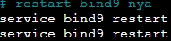

# Jarkom-Modul-2-T09-2021

Nama Anggota | NRP
------------------- | --------------		
Natasya Abygail N | 05111940000020
Muhammad Hilmi Ramadhan | 05311940000044
Sri Puspita Dewi | 05111940000045

## List of Contents :
- [Soal 1](#soal-1)
	- [Jawaban](#jawaban-soal-1)
- [Soal 2](#soal-2)
	- [Jawaban](#jawaban-soal-2)
- [Soal 3](#soal-3)
	- [Jawaban](#jawaban-soal-3)
- [Soal 4](#soal-4)
	- [Jawaban](#jawaban-soal-4)
- [Soal 5](#soal-5)
	- [Jawaban](#jawaban-soal-5)
- [Soal 6](#soal-6)
	- [Jawaban](#jawaban-soal-6)
- [Soal 7](#soal-7)
	- [Jawaban](#jawaban-soal-7)
- [Soal 8](#soal-8)
	- [Jawaban](#jawaban-soal-8)
- [Soal 9](#soal-9)
	- [Jawaban](#jawaban-soal-9)
- [Soal 10](#soal-10)
	- [Jawaban](#jawaban-soal-10)
- [Soal 11](#soal-11)
	- [Jawaban](#jawaban-soal-11)
- [Soal 12](#soal-12)
	- [Jawaban](#jawaban-soal-12)
- [Soal 13](#soal-13)
	- [Jawaban](#jawaban-soal-13)
- [Soal 14](#soal-14)
	- [Jawaban](#jawaban-soal-14)
- [Soal 15](#soal-15)
	- [Jawaban](#jawaban-soal-15)
- [Soal 15](#soal-16)
	- [Jawaban](#jawaban-soal-16)
- [Soal 17](#soal-17)
	- [Jawaban](#jawaban-soal-17)

## Notes:  - Prefix IP: 10.46   - [Soal Shift](https://docs.google.com/document/d/11_xDG1yHMIOAZVPksRV0VDwx8S4KIgtAMCLh3UD5-qM/edit)
---

## Soal 1
---
Buatlah topologi jaringan dengan detil berikut: `EniesLobby` akan dijadikan sebagai `DNS Master`, `Water7` akan dijadikan `DNS Slave`, dan `Skypie` akan digunakan sebagai `Web Server`. Terdapat 2 `Client` yaitu `Loguetown`, dan `Alabasta`. `Semua node terhubung` pada router `Foosha`, sehingga dapat mengakses internet
## Jawaban Soal 1 
---
Pertama-tama kami membuat sebuah node yang terhubung dengan internet dengan nama NAT1. Node tersebut kemudian disambungkan dengan router foosha melalui interface `nat0` menuju interface `eth0`. Selanjutnya konfigurasi IP router foosha seperti gambar berikut:

 

Selanjutnya lengkapi pembuatan topologi dengan menambahkan` node ethernet switch` dan `ubuntu` **(EniesLobby, Water7, Skypie, Loguetown, dan Alabasta)** seperti gambar berikut:

 

Kemudian setting network dari masing-masing node ubuntu dengan fitur Edit network configuration seperti berikut:
- Louguetown (Client) \

 

- Alabasta (Client) \

 

- EniesLobby (DNS Master) \

 

- Water7 (DNS Slave) \

 

- Skypie (Web Server) \

 

Lalu `restart` semua node dan ketikan pada router foosha `iptables -t nat -A POSTROUTING -o eth0 -j MASQUERADE -s 10.46.0.0/16` .
Kemudian agar setiap node terhubung ke router Foosha **(EniesLobby, Water7, Loguetown, dan Alabasta)**, maka diperlukan untuk `echo 'nameserver 192.168.122.1' > /etc/resolv.conf` yang diletakkan pada `/root/script.sh` . Berikut merupakan salah satu contoh pada `EniesLobby`:

- EniesLobby (DNS Master) \

 

---

## Soal 2
---
Membuat sebuah domain utama yang DNS nya di `EniesLobby` dengan url **`franky.ti9.com`** dengan alias **`www.franky.ti9.com`** pada `folder kaizoku`
## Jawaban Soal 2
---
Dalam menyelesaikan pembuatan domain utama, pertama-tama yang perlu dilakukan adalah konfigurasi pada `/etc/bind/named.conf.local` untuk pembuatan zone baru yang berisi `nama zone`, `type nya`, dan `lokasi konfigurasi db localnya`. Detilnya seperti gambar berikut:

Lalu kami membuat sebuah `direktori baru` yang mana akan menyimpan konfigurasi db local yang bernama `kaizoku`. Detilnya seperti gambar berikut:

Kemudian membuat db local untuk configurasi dari `franky.ti9.com` yang menyalin dari template `db.local`

Selanjutnya kami melakukan konfigurasi perubahan berupa dari `localhost` menjadi `franky.ti9.com`serta mengarahkannya menuju ke IP dari `EniesLobby` yaitu `10.46.2.2`

Setelah sudah ter-konfigurasi `file db.local` untuk `franky.ti9.com` maka `restart` dari `bind9`

Langkah selanjutnya yaitu membuat alias atau **`CNAME`** pada `www.franky.ti9.com` dengan menambahkan pada `file db.local` untuk `franky.ti9.com` yang bernama `franky.ti9.com`pada folder `kaizoku`. Tambahan yang dimaksud berupa  `www     IN      CNAME   franky.ti9.com.`

Setelah semuanya sudah maka lakukan `restart bind` kembali

---

## Soal 3
---
Membuat sebuah domain utama yang DNS nya di `EniesLobby` dengan url **`franky.ti9.com`** dengan alias **`www.franky.ti9.com`** pada `folder kaizoku`
## Jawaban Soal 3
---
Dalam menyelesaikan pembuatan domain utama, pertama-tama yang perlu dilakukan adalah konfigurasi pada `/etc/bind/named.conf.local` untuk pembuatan zone baru yang berisi `nama zone`, `type nya`, dan `lokasi konfigurasi db localnya`. Detilnya seperti gambar berikut:

---