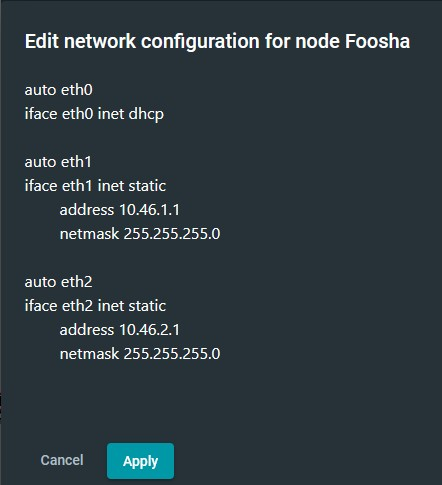
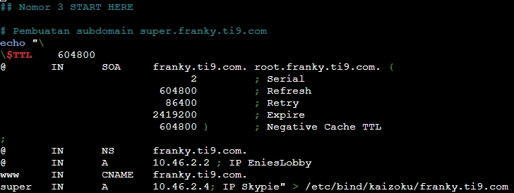
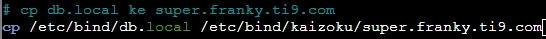
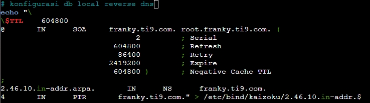

# Jarkom-Modul-2-T09-2021

Nama Anggota | NRP
------------------- | --------------		
Natasya Abygail N | 05111940000020
Muhammad Hilmi Ramadhan | 05311940000044
Sri Puspita Dewi | 05111940000045

## List of Contents :
- [Soal 1](#soal-1)
	- [Jawaban](#jawaban-soal-1)
- [Soal 2](#soal-2)
	- [Jawaban](#jawaban-soal-2)
- [Soal 3](#soal-3)
	- [Jawaban](#jawaban-soal-3)
- [Soal 4](#soal-4)
	- [Jawaban](#jawaban-soal-4)
- [Soal 5](#soal-5)
	- [Jawaban](#jawaban-soal-5)
- [Soal 6](#soal-6)
	- [Jawaban](#jawaban-soal-6)
- [Soal 7](#soal-7)
	- [Jawaban](#jawaban-soal-7)
- [Soal 8](#soal-8)
	- [Jawaban](#jawaban-soal-8)
- [Soal 9](#soal-9)
	- [Jawaban](#jawaban-soal-9)
- [Soal 10](#soal-10)
	- [Jawaban](#jawaban-soal-10)
- [Soal 11](#soal-11)
	- [Jawaban](#jawaban-soal-11)
- [Soal 12](#soal-12)
	- [Jawaban](#jawaban-soal-12)
- [Soal 13](#soal-13)
	- [Jawaban](#jawaban-soal-13)
- [Soal 14](#soal-14)
	- [Jawaban](#jawaban-soal-14)
- [Soal 15](#soal-15)
	- [Jawaban](#jawaban-soal-15)
- [Soal 15](#soal-16)
	- [Jawaban](#jawaban-soal-16)
- [Soal 17](#soal-17)
	- [Jawaban](#jawaban-soal-17)

## Notes:<br> - Prefix IP: 10.46 <br> - [Soal Shift](https://docs.google.com/document/d/11_xDG1yHMIOAZVPksRV0VDwx8S4KIgtAMCLh3UD5-qM/edit)
---

## Soal 1
---
Buatlah topologi jaringan dengan detil berikut: `EniesLobby` akan dijadikan sebagai `DNS Master`, `Water7` akan dijadikan `DNS Slave`, dan `Skypie` akan digunakan sebagai `Web Server`. Terdapat 2 `Client` yaitu `Loguetown`, dan `Alabasta`. `Semua node terhubung` pada router `Foosha`, sehingga dapat mengakses internet
## Jawaban Soal 1 
---
Pertama-tama kami membuat sebuah node yang terhubung dengan internet dengan nama NAT1. Node tersebut kemudian disambungkan dengan router foosha melalui interface `nat0` menuju interface `eth0`. Selanjutnya konfigurasi IP router foosha seperti gambar berikut:


<br>

Selanjutnya lengkapi pembuatan topologi dengan menambahkan` node ethernet switch` dan `ubuntu` **(EniesLobby, Water7, Skypie, Loguetown, dan Alabasta)** seperti gambar berikut:


<br>

Kemudian setting network dari masing-masing node ubuntu dengan fitur Edit network configuration seperti berikut:
- Louguetown (Client) \

<br>

- Alabasta (Client) \

<br>

- EniesLobby (DNS Master) \

<br>

- Water7 (DNS Slave) \

<br>

- Skypie (Web Server) \

<br>

Lalu `restart` semua node dan ketikan pada router foosha `iptables -t nat -A POSTROUTING -o eth0 -j MASQUERADE -s 10.46.0.0/16` .
Kemudian agar setiap node terhubung ke router Foosha **(EniesLobby, Water7, Loguetown, dan Alabasta)**, maka diperlukan untuk `echo 'nameserver 192.168.122.1' > /etc/resolv.conf` yang diletakkan pada `/root/script.sh` . Berikut merupakan salah satu contoh pada `EniesLobby`:

- EniesLobby (DNS Master) \

<br>

---

## Soal 2
---
Membuat sebuah domain utama yang DNS nya di `EniesLobby` dengan url **`franky.ti9.com`** dengan alias **`www.franky.ti9.com`** pada `folder kaizoku`
## Jawaban Soal 2
---
Dalam menyelesaikan pembuatan domain utama, pertama-tama yang perlu dilakukan adalah konfigurasi pada `/etc/bind/named.conf.local` untuk pembuatan zone baru yang berisi `nama zone`, `type nya`, dan `lokasi konfigurasi db localnya`. Detilnya seperti gambar berikut:


Lalu kami membuat sebuah `direktori baru` yang mana akan menyimpan konfigurasi db local yang bernama `kaizoku`. Detilnya seperti gambar berikut:


Kemudian membuat db local untuk configurasi dari `franky.ti9.com` yang menyalin dari template `db.local`


Selanjutnya kami melakukan konfigurasi perubahan berupa dari `localhost` menjadi `franky.ti9.com`serta mengarahkannya menuju ke IP dari `EniesLobby` yaitu `10.46.2.2`


Setelah sudah ter-konfigurasi `file db.local` untuk `franky.ti9.com` maka `restart` dari `bind9`


Langkah selanjutnya yaitu membuat alias atau **`CNAME`** pada `www.franky.ti9.com` dengan menambahkan pada `file db.local` untuk `franky.ti9.com` yang bernama `franky.ti9.com`pada folder `kaizoku`. Tambahan yang dimaksud berupa <br>`www     IN      CNAME   franky.ti9.com.`


Setelah semuanya sudah maka lakukan `restart bind` kembali


---

## Soal 3
---
Membuat subdomain `super.franky.ti9.com` dengan alias `CNAME` pada `www.super.franky.ti9.com` pada DNS master `EniesLobby` yang mengarah ke IP Skypie `10.46.2.4`
## Jawaban Soal 3
---
Dalam menyelesaikan pembuatan subdomain `super.franky.ti9.com`, kami tinggal menambahkan <br>`super   IN      A       10.46.2.4; IP Skypie`<br>
pada file `/etc/bind/kaizoku/franky.ti9.com`



Lalu `restart bind9`


Kemudian menambahkan `zone baru` untuk `super.franky.ti9.com` untuk membuat alias `www.super.franky.ti9.com` pada file `/etc/bind/named.conf.local`


Selanjutnya salin file `db.local` menjadi sebuah file baru dengan nama `super.franky.ti9.com`.



Lalu konfigurasi `db.local` untuk alias `www.super.franky.ti9.com` dengan menambahkan `www     IN      CNAME      super.franky.ti9.com.` .


Lalu `restart bind9`


---

## Soal 4
---
Buatlah reverse dns (Record PTR) dari domain utama `franky.ti9.com`
## Jawaban Soal 4
---
Dalam menyelesaikan pembuatan reverse dns `(Record PTR)` kami pertama-tama menginisialisasi sebuah zone baru pada `/etc/bind/kaizoku/2.46.10.in-addr.arpa` dengan detil sebagai berikut


Selanjutnya pembuatan file `db.local` untuk reverse dns dari `2.46.10.in-addr.arpa` dengan cara menyalin `template db.local` dari bind


Kemudian konfigurasi `db.local` pada `reverse dns`dengan menambahkan dua hal ini:<br>
`2.46.10.in-addr.arpa.       IN      NS      franky.ti9.com.`<br>
`4       IN      PTR       franky.ti9.com.` 



Setelah semuanya sudah maka lakukan `restart bind` kembali


---

## Soal 5
---
Supaya tetap bisa menghubungi Franky jika server EniesLobby rusak, maka buat Water7 sebagai DNS Slave untuk domain utama
## Jawaban Soal 5
---
Pertama kita harus ke  **EniesLobby** dahulu dimana kita menambahkan `notify, also-notify  (dengan IP Water7 [10.46.2.3]) dan allow-transfer (dengan IP Water7 [10.46.2.3])`  di folder kazoku pada `/etc/bind/named.conf.local`


Kemudian kita `restart dan stop`  kan di EniesLobby  agar hanya Water7nya saja yang aktif dengan mengetik ` service bind9 restart` dan `service bind9 stop`


Selanjutnya kita ke  **Water7**  dimana kita menkonfigurasi zone Dns Slavenya di `/etc/bind/named.conf.local` dengan type slave dan memasukan IP yang menjadi masternya yaitu IP EniesLobby `[10.46.2.2]` lalu kita lakukan restart ` service bind9 restart`


lalu kita lakukan ping di Loguetown untuk mengetes dns slavenya berhasil atau tidak dengan mengetik `ping franky.ti9.com`


---

## Soal 6
---
Setelah itu terdapat subdomain mecha.franky.ti9.com dengan alias www.mecha.franky.ti9.com yang didelegasikan dari EniesLobby ke Water7 dengan IP menuju ke Skypie dalam folder sunnygo
## Jawaban Soal 6
---
Pertama kita harus ke **EniesLobby** dahulu dimana kita akan mengkonfigurasikan franky.ti9.com di `/etc/bind/kazoku/franky.ti9.com`


lalu kita melakukan konfigurasi lagi di `/etc/bind/named.conf.options`


Kemudian kita `restart `  kan di EniesLobby,  ` service bind9 restart` 


Selanjutnya kita ke **Water7** dimana kita menkonfigurasikan pada `etc/bind/named.conf.options`


kita mengubah konfigurasinya di  `/etc/bind/named.conf.local`


lalu kita membuat direktory sunnygo dengan `mkdir /etc/bind/sunnygo` dan copy db localnya ke sunnygo di mecha.franky.ti9.com dengan `cp //etc/bind/db.local` 


di db local yg sudah di copy kita konfigurasikan 


dan terakhir kita restar dengan `service bind9 restart`


Pindah ke  **Loguetown** untuk mengetestnya  dengan melakukan `ping mecha.franky.ti9.com` lalu ping lagi `ping www.mecha.franky.ti9.com`


---

## Soal 7
---
Untuk memperlancar komunikasi Luffy dan rekannya, dibuatkan subdomain melalui Water7 dengan nama `general.mecha.franky.ti9.com` dengan alias `www.general.mecha.franky.ti9.com` yang mengarah ke Skypie

## Jawaban Soal 7
---
Semua tahapan berikut dilakukan pada `Water7`

Pertama akan dibuat dulu sebuah subdomain bernama `general.mecha.franky.ti9.com` dengan langkah awal melakukan config db.local yang ada pada `mecha.franky.ti9.com`

Berikut Konfigurasi db.local :


Setelah itu akan dijalankan bind restart untuk memastikan tidak ada yang salah dalam script yang kita tambahkan seperti gambar dibawah :


Kemudian selanjutnya dilanjutkan dengan pembuatan zone baru bernama `general.mecha.franky.ti9.com` menggunakan echo seperti pada contoh dibawah


Kemudian kita akan meng-copy db.local yang sudah kita buat sebelumnya ke file `www.general.mecha.franky.ti9.com` yang terletak di `etc/bind/sunnygo/general.mecha.franky.ti9.com` seperti pada gambar dibawah


Setelah selesai mengcopy db.local, dilanjutkan dengan mengkonfigurasi db.local tersebut sesuai yang tertera pada gambar


Terakhir, untuk memastikan semua proses yang telah dimasukkan kedalam `script.sh` sudah benar, kita akan melakukan restart bind9 kembali seperti pada gambar dibawah :


Untuk mengetes apakah subdomain yang dibuat telah berfungsi, kita menggunakan command berupa `ping general.mecha.franky.ti9.com` dan
`ping www.general.mecha.franky.ti9.com` pada console `Lougetown` hasil nya seperti pada contoh gambar dibawah :


---

## Soal 8
---
Setelah melakukan konfigurasi server, maka dilakukan konfigurasi Webserver. Pertama dengan webserver `www.franky.ti9.com` Pertama, luffy membutuhkan webserver dengan `DocumentRoot` pada `/var/www/franky.ti9.com`

## Jawaban Soal 8
---

Semua langkah beriku dilakukan pada `Skypie`

Langkah pertama dalam pengerjaan nomor 8 adalah mengupdate linux menggunakan command `apt-get update` seperti gambar dibawah


Dilanjutkan dengan meng-install apache2 menggunakan command `apt-get install apache2` setelah berhasil di-install akan langsung di-start menggunakan command `service apache2 start` 


Langkah selanjutnya adalah memulai instalasi php menggunakan command `apt-get install php` dan mengecek version php yang terinstall dengan `php -v`


Selanjutnya disini akan memulai insialisasi `DocumentRoot` pada `/var/www/franky.ti9.com` dengan cara :


Kemudian akan dimulai pengaktifan konfigurasi dari franky.ti9.com dengan command `a2ensite franky.ti9.com.comf`


Selanjutnya akan dibuat sebuah direktori `franky` pada `/var/www` menggunakan command `mkdir`


Langkah erakhir, untuk memastikan semua proses yang telah dimasukkan kedalam `script.sh` sudah benar, kita akan melakukan restart apache2


```txt
INI PENGUJIANNNYA BELOM DIMASUKIN AKU BINGUNG KATA" SAMA NGUJINYA GIMANA HELPP YAA~~
```
---

## Soal 9
---
Setelah itu, Luffy juga membutuhkan agar url `www.franky.ti9.com/index.php/home` dapat menjadi menjadi `www.franky.ti9.com/home`

## Jawaban Soal 9
---

Semua langkah berikut dilakukan pada `Skypie`

Langkah awal dalam pengerjaan soal nomor 9 adalah men-download `unzip` dengan command `apt-get install unzip`


Selanjutnya kita juga perlu untuk mendownload `wget` agar file yang diperlukan dapat di-download.


Kemudian disini akan dimulai proses untuk men-download requirment yang diperlukan yaitu `franky.zip` menggunakan `wget` yang tadi sudah di-download


Kemudian file zip yang tadi berhasil di-download akan di unzip dengan command `unzip -j /root/franky.zip -d /var/www/franky.ti9.com` 


Karena file zip yang tadi sudah tidak dibutuhkan kita akan menghapus file tersebut dengan `rm /root/franky.zip`


Kemudian selanjutnya kita akan mengaktifkan modul `rewrite` menggunakan `a2emond rewrite`


Kemudian selanjutnya akan dilakukan restart apache2


Setelah itu kita akan menghapus index.php dengan menambahkan `htacces` seperti pada gambar dibawah 


Langkah selanjutnya proses konfigurasi pada sites-available


Dan terakhir akan dilakukan restart apache2


```txt
INI BAGIAN PENGUJIAN~~
```
---

## Soal 10
---
Setelah itu, pada subdomain `www.super.franky.ti9.com` Luffy membutuhkan penyimpanan aset yang memiliki `DocumentRoot` pada `/var/www/super.franky.ti9.com`

## Jawaban Soal 10
---

Semua langkah berikut dilakukan pada `Skypie`

Langkah awal dalam pengerjaan soal nomor 10 adalah meng-inisialisasi `DocumentRoot` pada `/var/www/super.franky.ti9.com`


Selanjutnya adalah mengaktifkan konfigurasi dari `franky.ti9.com` menggunakan `a2ensite`


Dilanjutkan dengan pembuatan direktori franky pada `/var/www/`


Langkah terakhir adalah merestart apache2


INI TEMPAT PENGUJIANN~~

---

## Soal 11
---
Akan tetapi, pada folder `/public`, Luffy ingin hanya dapat melakukan `directory listing` saja

## Jawaban Soal 11
---

Semua langkah berikut dilakukan pada `Skypie`

Hal pertama yang dilakukan adalah men-download file zip yang dibutuhkan yaitu `super.franky.zip` seperti pada gambar dibawah


Selanjutnya file zip yang berhasil di-download akan memulai proses unzip dengan command seperti dibawah


Karena file zip yang tadi sudah berhasil di unzip, maka kita tidak membutuhkannya lagi, jadi akan dihapus dengan perintah `rm`


Selanjutnya kita akan memindahkan konten yang telah di unzip ke path `/var/www/super.franky.ti9.com/`


Yang terakhir adalah menghapus folder `super.franky` yang sudah tidak lagi dibutuhkan


```txt
INI TEMPAT PENGUJIANNN~~
```
---

## Soal 12
---
Tidak hanya itu, Luffy juga menyiapkan `error file 404.html` pada folder `/error` untuk mengganti error kode pada apache

## Jawaban Soal 12
---
Pertama kita ke **Skype** melakukan pengaturan di `/etc/apache2/sites-available/super.franky.ti9.com.conf` pada virtualhostnya, yang mana ditambahin ` ErrorDocument 404 /error/404.html`


lalu lakukan restart `service apache2 restart`


Kita pindah ke **Alabasta**  untuk melakukan pengecekkan atau test `lynx www.super.franky.ti9.com/publi`


---

## Soal 13
---
Luffy juga meminta Nami untuk dibuatkan konfigurasi virtual host. Virtual host ini bertujuan untuk dapat mengakses file asset `www.super.franky.ti9.com/public/js` menjadi `www.super.franky.ti9.com/js` 


## Jawaban Soal 13
---
Pertama kita ke **Skype** melakukan pengaturan di `/etc/apache2/sites-available/super.franky.ti9.com.conf` pada virtualhostnya, yang mana ditambahin ` Alias "/js" "/var/www/super.franky.ti9.com/public/js"`  lalu lakukan restart `service apache2 restart`


Kita pindah ke **Alabasta**  untuk melakukan pengecekkan atau test `www.super.franky.ti9.com`


---

## Soal 14
---
Dan Luffy meminta untuk web `www.general.mecha.franky.ti9.com` hanya bisa diakses dengan `port 15000` dan `port 15500`

## Jawaban Soal 14
---


---

## Soal 15
---
dengan autentikasi `username luffy` dan `password onepiece `dan file di `/var/www/general.mecha.franky.ti9.com`

## Jawaban Soal 15
---


---

## Soal 16
---
Dan setiap kali mengakses IP Skypie akan dialihkan secara otomatis ke `www.franky.ti9.com`

## Jawaban Soal 16
---


---

## Soal 17
---
Dikarenakan Franky juga ingin mengajak temannya untuk dapat menghubunginya melalui `website www.super.franky.yyy.com`, dan dikarenakan pengunjung web server pasti akan bingung dengan randomnya images yang ada, maka Franky juga `meminta untuk mengganti request gambar yang memiliki substring “franky”` akan `diarahkan menuju franky.png`

## Jawaban Soal 17
---


---
